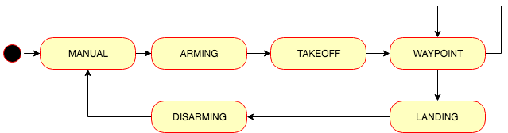
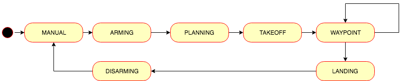

# FCND-Term1-P2-3D-Motion-Planning
Udacity Flying Car Nanodegree - Term 1 - Project 2 - 3D Motion Planning

To run this project you need to have the following software installed:

- [Miniconda](https://conda.io/miniconda.html) with Python 3.6. I had some problems while installing this on my Mac after having an older version install and some other packages install with Homebrew. I have to manually delete all the `~/*conda*` directory from my home and then install it with `bash Miniconda3-latest-MacOSX-x86_64.sh -b`.
- [Udacity FCND Simulator](https://github.com/udacity/FCND-Simulator-Releases/releases) the latest the better.

# Run the

# [Project Rubric](https://review.udacity.com/#!/rubrics/1534/view)

## Writeup

### Provide a Writeup / README that includes all the rubric points and how you addressed each one. You can submit your writeup as markdown or pdf.

You're reading it! Below I describe how I addressed each rubric point and where in my code each point is handled.

## Explain the Starter Code

### Test that `motion_planning.py` is a modified version of `backyard_flyer_solution.py` for simple path planning. Verify that both scripts work. Then, compare them side by side and describe in words how each of the modifications implemented in `motion_planning.py` is functioning.

Both version are similar in the sense they implement a [finite-state machine](https://en.wikipedia.org/wiki/Finite-state_machine) to command the drone. They are similar but not exactly the same. On the [`backyard_flyer_solution.py`](./backyard_flyer_solution.py) the states and transitions represented are:

The state machine implemented on [`motion_planning.py`](./motion_planning_from_seed_project.py), adds another state to the previous one:

There is a new state, `PLANNING`, between  `ARMING` and `TAKEOFF`. When the drone is at the state `ARMING` and it is actually armed ([line 66](./motion_planning_from_seed_project.py#L66)) on the `state_callback` method ([lines 61 to 72](./motion_planning_from_seed_project.py#L61-L72)), the transition to `PLANNING` is executed on the method [`plan_path`](./motion_planning_from_seed_project.py#L114-160). This method responsibility is to calculate the waypoints necessary for the drone to arrive at its destination.

On the `plan_path` method:
- The map is loaded ([line 133](./motion_planning_from_seed_project.py#L133))
- The grid is calculated at [line 136](./motion_planning_from_seed_project.py#L136) using the method [`create_grid`](./planning_utils_from_seed_project.py#L6-L41) from the module [`planning_utils.py`](./planning_utils_from_seed_project.py).
- The goal grid is set 10 north and east from local position on [line 144]((./motion_planning_from_seed_project.py#L144)).
- To find the path to the goal, [A* search algorithm](https://en.wikipedia.org/wiki/A*_search_algorithm) is executed on [line 151](./motion_planning_from_seed_project.py#L151) using the [`a_star`](./planning_utils_from_seed_project.py#L91-L140) method from the module [`planning_utils.py`](./planning_utils_from_seed_project.py).
- The waypoints are generated at [line 157](./motion_planning_from_seed_project.py#L157), and they are sent to the simulator using the method [`send_waypoints`](././motion_planning_from_seed_project.py#L109-L112) at [line 161](./motion_planning_from_seed_project.py#L161).

## Implementing Your Path Planning Algorithm

### In the starter code, we assume that the home position is where the drone first initializes, but in reality you need to be able to start planning from anywhere. Modify your code to read the global home location from the first line of the `colliders.csv` file and set that position as global home (`self.set_home_position()`)

The home position is read at [motion_planning.py line 124](./motion_planning.py#L124). It use the function [`read_home`](./planning_utils.py#L145-L155) added to `planning_utils.py`.

### In the starter code, we assume the drone takes off from map center, but you'll need to be able to takeoff from anywhere. Retrieve your current position in geodetic coordinates from `self._latitude()`, `self._longitude()` and `self._altitude()`. Then use the utility function `global_to_local()` to convert to local position (using `self.global_home()` as well, which you just set)

This coordinates transformation is done at [line 130](./motion_planning.py#L130).

### In the starter code, the start point for planning is hardcoded as map center. Change this to be your current local position.

The grid star point is calculated from [line 144 to 146](./motion_planning.py#L144-L146).

### In the starter code, the goal position is hardcoded as some location 10 m north and 10 m east of map center. Modify this to be set as some arbitrary position on the grid given any geodetic coordinates (latitude, longitude)

Three new parameters were added to the [motion_planning.py](./motion_planning.py#L189-L191) to accept goals coordinates. The coordinates are converted to local coordinates at [lines 151 to 152](./motion_planning.py#L151-L152) to be used on the search algorithm.

### Write your search algorithm. Minimum requirement here is to add diagonal motions to the A* implementation provided, and assign them a cost of sqrt(2). However, you're encouraged to get creative and try other methods from the lessons and beyond!

The diagonals movements were implemented by adding them to the [Action enum](./planning_utils.py#L59-L62). The [valid_actions method](./planning_utils.py#L92-L99) was modified to take those actions into account.

### Cull waypoints from the path you determine using search.

## Executing the flight

### This is simply a check on whether it all worked. Send the waypoints and the autopilot should fly you from start to goal!
